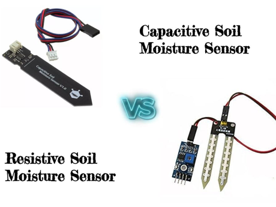
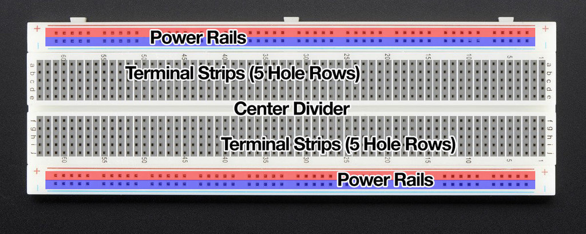
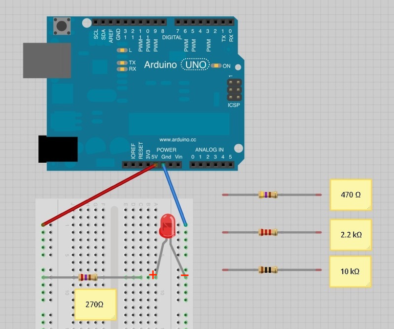
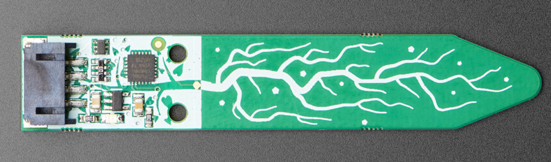
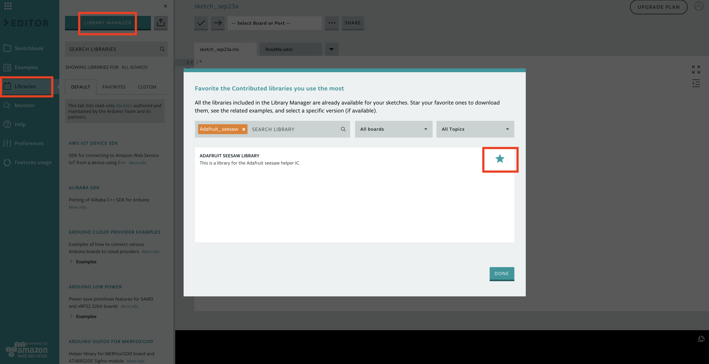

# Build With Us: IoT to Keep Your Plants Alive!

Presenters: Ivy Malao, Star Washington, Yanning Qu

# Overview

Tables will work together to build a simple device that tells you when to water a plant. Wiring together and writing code for an Arduino, LEDs, moisture sensor, you will be able to use your device in different potted plants to determine which are over or under-watered. 

These instruction are divided into **three separate modules**: setting up the **Arduino**, working with the **LEDs** and working with the  **moisture sensor**. The **last step** is to figure out how to use the moisture sensor readings to control the LEDs.

# Materials

-	Arduino Uno
-	Half breadboard
-	Adafruit I2C Capacitive Moisture Sensor
-	4-pin JST-PH cable
-	LEDs
-	Resistors 
-	USB-B cable
-	Jumper wires

Moisture sensors include two styles: resistive sensors and capacitive sensors. 

Resistive style sensors use two probes to pass current through the soil and read the resistance to get the moisture level. Wet soil causes the soil to conduct electricity better (less resistance). Corrosion of the sensor probes limits the lifespan of a resistive sensor.

Capacitive moisture sensors use only one probe and do not have any exposed metal. They work by measuring the “dielectric” that is formed by the soil. Water is the most important factor that affects the dielectric and the sensor measures specifically the dissolved ions (electrically charged molecules). **Capacitive moisture sensors will give you a reading ranging from 200 (very dry) to 2000 (very wet).**



Just about every breadboard is made of three sections: Two sets of very long power rails and a large middle section that is full of 5-hole-long terminal strips. 

The power rails are used to distribute the power and ground connections along the entire circuit. To help keep track of which rail is ground and which is power, connect positive / power to red (+) and connect ground to blue (-).

Put the components in the middle section, with each pin connected to a rows terminal strip.



# Instructions

## Hardware and Arduino Simulator

As each table is provided with only one set of hardware components, you can optionally use [Tinkercad](https://www.tinkercad.com/) to simulate the Arduino and hardware. 

## (Module 1) Setting up the Arduino

-	Create an **Online Arduino Web Editor Account** (create.arduino.cc) or download the **Arduino desktop IDE**
-	Install **Arduino Create Plugin** to upload code to the Arduino
- Arduino's "Hello World": Blink the on-board LED by copying this code into your sketch:

```
// the setup function runs once when you press reset or power the board
void setup() {
  // initialize digital pin LED_BUILTIN as an output.
  pinMode(LED_BUILTIN, OUTPUT);
}

// the loop function runs over and over again forever
void loop() {
  digitalWrite(LED_BUILTIN, HIGH);   // turn the LED on (HIGH is the voltage level)
  delay(1000);                       // wait for a second
  digitalWrite(LED_BUILTIN, LOW);    // turn the LED off by making the voltage LOW
  delay(1000);                       // wait for a second
}
```

You can also find the code [here](https://github.com/imalao/ghc2019_workshop/blob/master/code/hello_world.ino).

- Connect your Arduino to your laptop using the USB-B cable. 
- **Upload and save** your code by clicking the arrow at the top. If "Arduino/Gunuino Uno" doesn't come up in the drop-down menu, check to see you have the **Arduino Create Plugin** installed.
- Your Arduino's light should now be flashing! 

## (Module 2) LEDs

  

-	Connect your stripboard as shown above using the jumper wires, any resistor, and LED. The Arduino will provide power if you plug it in with the USB-B cable. LEDs have a positive and negative leads and will not light if they are the wrong way around. The positive lead is longer.
-	With the 270 Ohm resistor, the LED should be quite bright. You can use any of the provided resistors.
-	Now attach the LED to a digital output pin of the Arduino so that you can control the LED with code. Move the jumper wire connected to power (the 5V pin) to one of the digital pins (e.g. 13). This should be the red wire in the diagram.
-	Blink the LEDs using the following code sample:

```
/*
  Blink
  Turns on an LED on for one second, then off for one second, repeatedly.
 
  This example code is in the public domain.
 */
 
// Pin 13 has an LED connected on most Arduino boards.
// give it a name:
int led = 13;
 
// the setup routine runs once when you press reset:
void setup() {                
  // initialize the digital pin as an output.
  pinMode(led, OUTPUT);     
}
 
// the loop routine runs over and over again forever:
void loop() {
  // initialize the digital pin as an output.
  digitalWrite(led, HIGH);   // turn the LED on (HIGH is the voltage level)
  delay(1000);               // wait for a second
  digitalWrite(led, LOW);    // turn the LED off by making the voltage LOW
  delay(1000);               // wait for a second
}
```

You can also find the code [here](https://github.com/imalao/ghc2019_workshop/blob/master/code/blink.ino).
- Connect your Arduino to your laptop using the USB-B cable. 
- **Upload and save** your code by clicking the arrow at the top. If "Arduino/Gunuino Uno" doesn't come up in the drop-down menu, check to see you have the **Arduino Create Plugin** installed.

## (Module 3) Moisture Sensor 

### Hardware

Connect the moisture sensor to the Arduino using the 4-pin JST-PH cable. JST is just the manufacturer’s name and PH is the series of cable.

 

Looking at the image above, from top to bottom, the pinout is

1.	**I2C SCL**: Clock Line used to synchronize all data transfers over the I2C bus. 
2.	**I2C SDA**: Data Line
3.	**Vin**: 3-5V DC. Has a regulator which supplies 5V to the 5V pin/node
4.	**GND**: power and logic ground

  

- Connect **Vin Red Wire to the power supply**. Use the same voltage that the microcontroller logic is based off of. For most Arduino's, that is 5V.
- Connect **GND Black Wire to common power/data ground**
- Connect the **SCL Green Wire pin to the I2C clock SCL pin** on your Arduino. On an UNO Arduino, this is also known as A5.
- Connect the **SDA White Wire pin to the I2C data SDA pin** on your Arduino. On an UNO Arduino, this is also known as A4.

### Software

-	After setting up your Arduino (Module 1), install the Adafruit libraries
    - Click on **Libraries** on the left bar
    - Click on **Library Manager**, the blue button on the top. 
    - Search for **Adafruit_seesaw** and click on the **star** to download the library. 
    - Go to **Favorites**, mouse over the Adafruit Seesaw Library, and click **Include** to include the Adafruit seesaw libraries.
 
   
  
- Use the following code sample:

```
#include “Adafruit_seesaw.h”;
Adafruit_seesaw ss;

// to communicate with the computer, use one of the following rates: 
// 300, 600, 1200, 2400, 4800, 9600, 14400, 19200, 28800, 38400, 57600, or 115200.
uint16 serial_baud = 0; // Set the serial_baud rate
uint16 seesaw_I2C_address = 0x36; // Adafruit seesaw I2C address
 
// the setup routine runs once when you press reset:
void setup() {                
  // initialize the digital pin as an output.
  Serial.begin(serial_baud);
  Serial.println("Seesaw Soil Sensor example");
  if (!ss.begin(seesaw_I2C_address)) {
    Serial.println("ERROR! seesaw not found");
    while (1);
  } else {
    Serial.print("Seesaw started! version: ");
    Serial.println(ss.getVersion(), HEX);
  }
}

// the loop routine runs over and over again forever:
void loop() {
  // see https://adafruit.github.io/Adafruit_Seesaw/html/class_adafruit__seesaw.html for documentation
  float tempC = ss.getTemp(); // temperature reading
  Uint16_t capread = ss.touchRead(0); // capacitive reading

  Serial.print("Temperature: "); Serial.print(tempC);
  Serial.println("*C");               
  Serial.print("Capacitive: "); Serial.println(capread);
  delay(1000);               // wait for a second
}

```

You can also find the code [here](https://github.com/imalao/ghc2019_workshop/blob/master/code/moisture_sensor.ino).

- Connect your Arduino to your laptop using the USB-B cable. 
- **Upload and save** your code by clicking the arrow at the top. If "Arduino/Gunuino Uno" doesn't come up in the drop-down menu, check to see you have the **Arduino Create Plugin** installed.
- Click **Monitor** to read the serial console output. 
- Open up the serial console at the baud rate you set in `serial_baud` to see the temperature and capacitive reading. **Baud** is a measurement of bit rate.
7.	Try touching the body of the sensor to make the moisture measurement go up. The temperature reading is only on the chip itself but gives an idea of the room’s temperature.

## Last Step!

Modify and combine your LED code and moisture sensor code to control your LEDs based on the moisture or temperature reading! For example, you can blink your LEDs at different rates or turn on different colored LEDs based on your measurements.

# Next Steps!

If you have a general interest in electronics and IoT, start with Arduinos!

-	An open-source electronics prototyping platform where each of their boards has a microcontroller that let you program to do things and can interact with the world. 
-	Most of their projects are open source, meaning they provide you with schematics, printed circuit board design, and bill of materials (BOM) 
-	See ”getting started” page under resource on Arduino website.
-	https://www.makeuseof.com/tag/arduino-technology-explained/

If you are really interested in making electronic gadgets and doing embedded programming: 

-	Have a basic understanding of voltage, current, power, resistance, etc.
-	Learn by building circuits on a breadboard from any circuit diagrams you can find online or in books
-	Have a basic understanding of electronic components: resistor, diode, LED, capacitor, inductor, transistor
  - Try to build a switch with transistor! This is not easy but very useful
-	Learn how to solder -- you don't want to use breadboard forever. Soldering is very fun, and not hard to learn. All you need to do is practice.
-	Build circuits using integrated circuit (aka IC or a chip) -- basically any type of circuit that is made to fit onto a single chip.
-	Design your own circuit
  - 	Autodesk Eagle PCB design software is free if you are not designing very complex circuits. You can learn how to create a schematic and PCB layout, and then how to order cheap PCB prototypes (1-day or 2-day turn, how many layers and size, use of vias, polygon pour)
-	Learn to use a microcontroller. Embedded programming is not running on an operating system but directly interfacing with hardware
-	Learn C and assembly. The majority of embedded toolchains are designed to support C
-	Get basic equipment: meters (DMM, scope), debugger, logic analyzer (convert captured data into timing diagrams)
-	Choose a microcontroller and toolchain...
-	Be prepared to dig into datasheets! You will spend a lot of time on reading datasheets.
-	Have fun!


# Useful References

Books

-	Practical Electronics for Inventors by Paul Scherz & Simon Monk
-	The Art of Electronics by Paul Horowitz & Winfield Hill
-	Fundamentals of Analog and Digital Electronic Circuits, by Anant Agarwal
-	Beginning C From Novice to Professional by Ivor Horton

Websites

-	https://www.allaboutcircuits.com/textbook/

Videos

-	Coursera
-	Udemy
-	YouTube

Games

-	Shenzhen I/O: Build circuits and write code on Steam!


# Works Cited

- https://learn.adafruit.com/adafruit-stemma-soil-sensor-i2c-capacitive-moisture-sensor/overview
- https://learn.adafruit.com/adafruit-arduino-lesson-2-leds/overview
- https://www.arduino.cc/en/tutorial/blink
- https://www.switchdoc.com/2018/11/tutorial-capacitive-moisture-sensor-grove/

